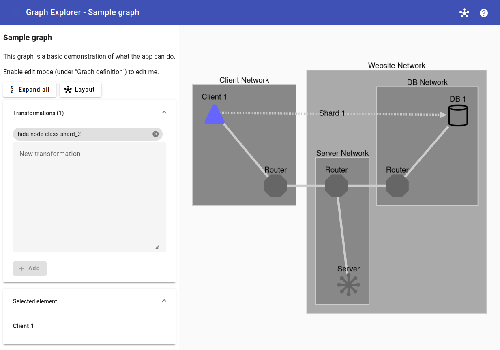
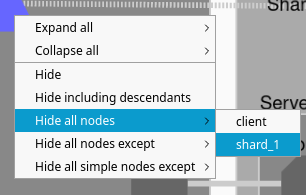
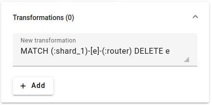

# Grafocus

Grafocus allows you to explore large heterogeneous graphs like architecture
diagrams, filtering out unwanted details and focusing on what's important.
Examples would include focusing in on a single subsystem, or everything needed
to implement a single feature, or everything using a particular technology.

Entire sets of nodes can be dynamically shown/hidden, and compound nodes can be
expanded/collapsed.  Filtering can be done either through menus:

or written by hand in [GQL](https://www.gqlstandards.org) for maximum
expressiveness:

## Graph definition

Graph data can be loaded with the `?graphUrl=` query parameter.  This must point
to a JSON file which looks like the [example](example.json), which is validated
against the [schema](src/app/schema.ts).

Nodes and edges are the core graph elements.  Parent/child relationships (for
compound nodes) as well as layout are also defined through special edges with
the `_PARENT`, `_ALIGN_VERTICAL`, `_ALIGN_HORIZONTAL`, `_PLACE_BELOW`, or
`_PLACE_RIGHT_OF` labels.  These edges are not visible in the rendered graph,
but they can be used in transformations.

The stylesheet follows [Cytoscape.js's format](https://js.cytoscape.org/#style).
Classes are the node/edge labels prefixed with `user_data_`.

## Data handling

No data is stored or transferred out of the browser, which means that once the
tab is closed, entered data is gone.  However, please consider the risks and be
conscious of the data you enter into the application.

## Developing

This project uses [Angular](https://github.com/angular/angular).

### Development server

Run `ng serve` for a dev server. Navigate to `http://localhost:4200/`. The
application will automatically reload if you change any of the source files.

### Code scaffolding

Run `ng generate component component-name` to generate a new component. You can
also use `ng generate directive|pipe|service|class|guard|interface|enum|module`.

### Build

Run `ng build` to build the project. The build artifacts will be stored in the
`dist/` directory.

### Running unit tests

Run `ng test` to execute the unit tests via
[Karma](https://karma-runner.github.io).

## Contributing

See [CONTRIBUTING.md](CONTRIBUTING.md) for details.

## License

Apache 2.0; see [LICENSE](LICENSE) for details.

## Disclaimer

This project is not an official Google project. It is not supported by Google
and Google specifically disclaims all warranties as to its quality,
merchantability, or fitness for a particular purpose.
